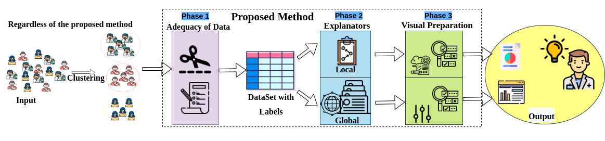

# Multilevel Clustering Explainer: An explainable Approach to Hospitalization Record


**Attention**: MCE **not** a commercial method. It is designed for educational and demonstration purposes **only**.

### 1. Brief introduction ###
The repository is organized as follows:
  * [Experiments Results:](https://github.com/clementinojr/Multilevel-Clustering-Explainer-an-explainable-Approach-to-EHR/tree/main/Experiments-Result) contains the base files used to implement and obtain the results. The files contain the figures of the results obtained for both local and global level.
  * [Recovery:](https://github.com/clementinojr/Multilevel-Clustering-Explainer-an-explainable-Approach-to-EHR/tree/main/Recovery) contain the code and notebook used in the pre-processing of the visualization to retrieve the information described in phase 3 of the proposed method.
   * [plot_functions:](https://github.com/clementinojr/Multilevel-Clustering-Explainer-an-explainable-Approach-to-EHR/tree/main/plot_functions) contains the functions used to generate the visual graphics.
* [complete_script_.py:]And in the file "..." contains the script used to generate all the results both globally and locally.

### 2. Minimum requirements ###

* Python 3.
* PostgreSQL.

### 3. Required Library ###
  * json
  * re
  * pandas 
  * numpy 
  * sklearn.metrics *
  * time import gmtime, strftime
  * datetime import datetime
  * lime
  * others


### 4. Multilevel Clustering Explainer (MCE)  workflow. Adequacy of data in(Phase~1), construction of explanatory information (with different levels of detail, Local or Global) in(Phase 2), and presentation of information in(Phase 3 ###

 


```
### Acknowledgement ###
The authors would like to thank Brazilian Coordination of Superior Level Staff Improvement (CAPES), grant PROEX-11357281/M;  the Sao Paulo Research Foundation (FAPESP), grants  2016/17078-0, 2018/06228-7, 2019/04660-1, 2018/06074-0; and the National Council for Scientific and Technological Development (CNPq).


### References ####

[1] Dalianis Hercules, Hassel Martin, Henriksson Aron, Skeppstedt Maria.Stockholm  epr  corpus:  A  clinical database  used  to  improve  health  care   //  Swedish  Lan-guage Technology Conference. 2012. 17–18.

[2] Funkner Anastasia A., Yakovlev Aleksey N., Kovalchuk Sergey V.Towards  evolutionary  discovery  of  typical clinical pathways in electronic health records  // Procedia Computer  Science.  2017.  119.  234  –  244.   6th  International Young Scientist Conference on Computational Science, YSC 2017, 01-03 November 2017, Kotka, Finland.

[3]Galetsi Panagiota, Katsaliaki Korina, Kumar Sameer.Big  data  analytics  in  health  sector:  Theoretical  framework,  techniques  and  prospects  //  International  Journalof Information Management. 2020. 50. 206–216.

[4] Garcelon Nicolas, Neuraz Antoine, Benoit Vincent, Salomon Rémi, Kracker Sven, Suarez Felipe, Bahi-BuissonNadia,  HadjRabia  Smail,  Fischer  Alain,  MunnichArnold, others.   Finding  patients  using  similarity  measures in a rare diseases-oriented clinical data warehouse:Dr.  Warehouse  and  the  needle  in  the  needle  stack    //Journal of biomedical informatics. 2017. 73. 51–61.

[5] Gudivada V. N., Baeza-Yates R., Raghavan V. V.BigData:  Promises  and  Problems   //  Computer.  Mar  2015.48, 3. 20–23.

[6] Gupta R., Singhal A., Sai Sabitha A.Comparative Study of Clustering Algorithms by Conducting a District Level Analysis of Malnutrition  // 2018 8th International Conference on Cloud Computing, Data Science Engineering(Confluence). Jan 2018. 280–286.

[7] Hirano S., Iwata H., Kimura T., Tsumoto S.Clinical Pathway Generation from Order Histories and Discharge Summaries    //  2019  International  Conference  on  DataMining Workshops (ICDMW). Nov 2019. 333–340.

[8] Hoang Khanh Hung, Ho Tu Bao.  Learning  and  recommending  treatments  using  electronic  medical  records  //Knowledge-Based Systems. 2019. 181. 104788.


[9] Huang Zhengxing, Dong Wei, Ji Lei, Gan Chenxi,Lu Xudong, Duan Huilong.  Discovery  of  clinical  path-way  patterns  from  event  logs  using  probabilistic  topicmodels  //  Journal  of  Biomedical  Informatics.  2014.  47.39 – 57.


[10] Huang Zhengxing, Lu Xudong, Duan Huilong.Onmining clinical pathway patterns from medical behaviors//  Artificial  Intelligence  in  Medicine.  2012.  56,  1.  35  –50.


[11] Lima Daniel M, Rodrigues-Jr Jose F, Traina Agma JM,Pires Fabio A, Gutierrez Marco A.   Transforming  twodecades of ePR data to OMOP CDM for clinical research// Stud Health Technol Inform. 2019. 264. 233–237.


[12] Lin Yu-Kai, Lin Mingfeng, Chen Hsinchun. Do ElectronicHealth  Records  Affect  Quality  of  Care?  Evidence  from the HITECH Act // Information Systems Research. 2019.30, 1. 306–318.


[13]Lismont Jasmien, Janssens Anne-Sophie, OdnoletkovaIrina, Broucke Seppe vanden, Caron Filip, VanthienenJan.  A guide for the application of analytics on health-care processes: A dynamic view on patient pathways  //Computers  in  Biology  and  Medicine.  2016.  77.  125  –134.

[14] Salton G., Lesk M. E.Computer Evaluation of Indexingand Text Processing  // J. ACM. I 1968. 15, 1. 8–36.

[15] Usino Wendi, Prabuwono Anton Satria, Allehaibi KhalidHamed S., Bramantoro Arif, A Hasniaty, Amaldi Wahyu.Document Similarity Detection using K-Means and Cosine  Distance//  International  Journal  of  Advanced Computer Science and Applications. 2019. 10, 2.

[16] Yang Jun, Jiang Yu-Gang, Hauptmann Alexander G.,Ngo Chong-Wah.   Evaluating  Bag-of-visual-words  Representations  in  Scene  Classification    //  Proceedings  ofthe International Workshop on Workshop on Multimedia Information Retrieval. New York, NY, USA: ACM, 2007.197–206.  (MIR ’07).

[17] Zhao Jing, Papapetrou Panagiotis, Asker Lars, BostromHenrik.Learning  from  heterogeneous  temporal  datain  electronic  health  records    //  Journal  of  Biomedical Informatics. 2017. 65. 105 – 119


### Contact ###

This work is part of my program master's degree. You can contact me writing to [juniorclementino@usp.br](https://jrclementino.netlify.com/).
